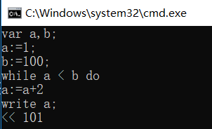
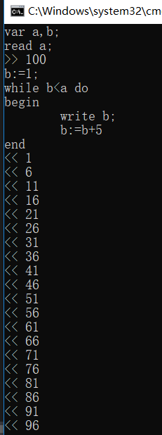
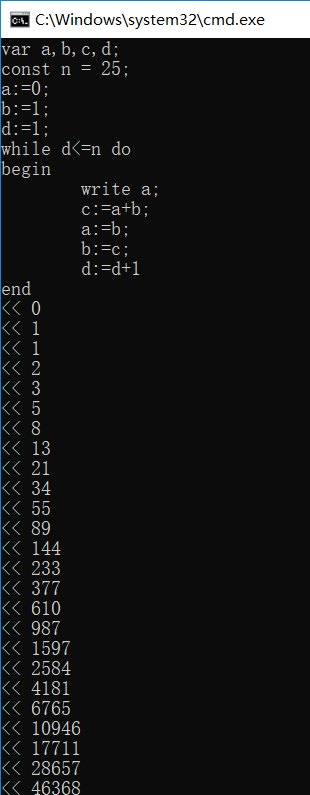
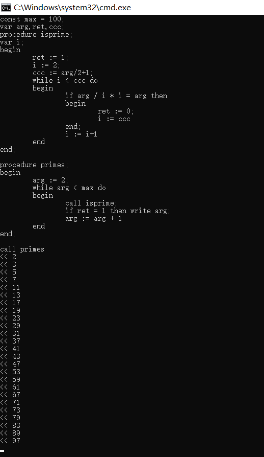

# PL0-interactive-command-line-executor

this is a simple interpertor of PL/0 language

you can use it to write some simple code following the syntax given by [wiki PL/0](https://en.wikipedia.org/wiki/PL/0)

so let me show how to code with it:

First, build it with GNU make
```
make 
```

Then, run
```
make run
```

write down a while loop



read a variable and loop



even further, a fibonacii sequence 



print the primes between 2 and 100



